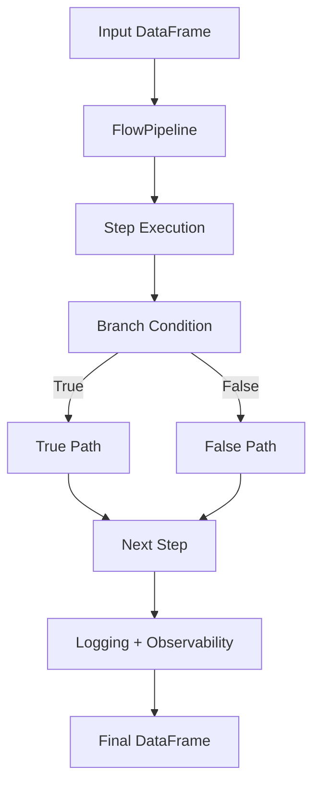

<h1 align="center">dfflow</h1>

<p align="center">
  <a href="https://pypi.org/project/dfflow/"></a>
  <a href="https://pypi.org/project/dfflow/"></a>
  <a href="https://github.com/maclin-oss/dfflow/actions/workflows/tests.yml"></a>
  <a href="https://pypi.org/project/dfflow/"></a>
</p>

<p align="center">
  <strong>Observability-first DataFrame pipeline engine — with step caching, conditional branching, intelligent diff tracking, and structured logging.</strong>
</p>

---

## Table of Contents

- [Why dfflow?](#why-dfflow)
- [Architecture Overview](#architecture-overview)
- [Installation](#installation)
- [Quick Start](#quick-start)
- [Core API Reference](#core-api-reference)
  - [FlowPipeline](#flowpipeline)
  - [Step](#step)
  - [Branch](#branch)
  - [DFLogger](#dflogger)
  - [@step Decorator](#step-decorator)
  - [Built-in Cleaning Steps](#built-in-cleaning-steps)
  - [DataProfiler](#dataprofiler)
  - [DataFrame Diff Engine](#dataframe-diff-engine)
  - [Observability Formatter](#observability-formatter)
  - [Pipeline Visualizer](#pipeline-visualizer)
  - [Hashing Utility](#hashing-utility)
  - [Exceptions](#exceptions)
- [Examples](#examples)
- [License](#license)

---

## Why dfflow?

In production ML and data engineering pipelines, DataFrames transform silently at every step. Standard Python loggers have no concept of rows, nulls, or memory — so issues like "we lost 40% of rows in step 3" go completely unnoticed until downstream.

**dfflow solves this by making every transformation observable by default.**

| Pain Point | dfflow Solution |
|---|---|
| Silent data loss between steps | Shape and row diff at every step |
| Unknown null propagation | Null diff tracking (added / removed) |
| Unexplained memory spikes | Memory delta in MB per step |
| Redundant computation on unchanged data | Content-hash-based step caching |
| No pipeline audit trail | Unique `run_id` per execution |
| Blind to column schema drift | Column add/remove diff |
| Hard to gauge transformation risk | Automated LOW / MEDIUM / HIGH impact scoring |
| Repetitive step-tracking boilerplate | `@step` decorator with metadata injection |
| Different logic for different data shapes | Conditional branching with `add_branch()` |

---

## Architecture Overview



---

## Installation

```bash
pip install dfflow
```

**Requirements:**

| Requirement | Version |
|---|---------|
| Python | >= 3.10 |
| pandas | >= 1.5  |

**Install with dev extras** (pytest, coverage, mypy, ruff):

```bash
pip install "dfflow[dev]"
```

---

## Quick Start

```python
import pandas as pd
from dfflow import FlowPipeline, Step, DFLogger, drop_nulls, lowercase_columns

df = pd.DataFrame({
    "Name":    ["Alice", None, "Bob"],
    "AGE":     [25, 30, None],
    "Revenue": [500.0, 1200.0, 800.0],
})

logger = DFLogger(log_file="pipeline.log", min_level="INFO")

pipeline = FlowPipeline(logger=logger)
pipeline.add_step(drop_nulls)
pipeline.add_step(lowercase_columns)
pipeline.add_branch(
    name="Revenue Router",
    # condition must return Python bool or numpy.bool_
    condition=lambda df: df["revenue"].mean() > 1000,
    if_true=[Step("Premium", lambda df: df.assign(tier="premium"))],
    if_false=[Step("Standard", lambda df: df.assign(tier="standard"))],
)

print(pipeline.visualize())
result = pipeline.run(df, show_observability=True)
print(result)
```

---

## Core API Reference

---

### FlowPipeline

**Module:** `dfflow.core.pipeline`
**Import:** `from dfflow import FlowPipeline`

The central execution engine. Manages an ordered list of `Step` and `Branch` nodes, handles caching, logging, and observability reporting for every transformation.

#### Constructor

```python
FlowPipeline(logger: DFLogger | None = None)
```

| Parameter | Type | Default | Description |
|---|---|---|---|
| `logger` | `DFLogger \| None` | `None` | Optional logger instance. |

Internally assigns a unique `run_id` (UUID4) to each pipeline instance for audit tracing.

---

#### `add_step`

```python
pipeline.add_step(step_or_func: Step | Callable) -> None
```

Adds a transformation step to the pipeline. Accepts either a `Step` instance or a function decorated with `@step`.

Raises `TypeError` if the argument is neither a `Step` nor a decorated callable.

```python
from dfflow import FlowPipeline, Step, step

pipeline = FlowPipeline()
pipeline.add_step(Step("Normalize", lambda df: df / df.max()))

@step("Clean Names", cacheable=True)
def clean_names(df):
    df = df.copy()
    df["name"] = df["name"].str.strip()
    return df

pipeline.add_step(clean_names)
```

---

#### `add_branch`

```python
pipeline.add_branch(
    name: str,
    condition: Callable[[pd.DataFrame], bool],
    if_true: list[Step],
    if_false: list[Step] | None = None,
) -> None
```

Adds a conditional branch node. At runtime `condition(df)` is evaluated — `True` runs `if_true`, `False` runs `if_false`.

| Parameter | Type | Default | Description |
|---|---|---|---|
| `name` | `str` | required | Label shown in logs and `visualize()`. |
| `condition` | `Callable[[pd.DataFrame], bool]` | required | Predicate returning `bool`. |
| `if_true` | `list[Step]` | required | Steps when condition is `True`. |
| `if_false` | `list[Step] \| None` | `None` | Steps when condition is `False`. `None` or `[]` = pass-through. |

```python
pipeline.add_branch(
    name="Null Guard",
    condition=lambda df: df.isnull().any().any(),
    if_true=[Step("Fill Zeros", lambda df: df.fillna(0))],
    if_false=[],
)
```

---

#### `run`

```python
pipeline.run(df: pd.DataFrame, show_observability: bool = False) -> pd.DataFrame
```

Executes all nodes sequentially.

| Parameter | Type | Default | Description |
|---|---|---|---|
| `df` | `pd.DataFrame` | required | Input DataFrame. |
| `show_observability` | `bool` | `False` | If `True`, logs full diff report after every step. |

**Raises:** `TypeError` if input is not a DataFrame. `PipelineStepError` if any step fails.

---

#### `visualize`

```python
pipeline.visualize() -> str
```

Returns an ASCII diagram of the full pipeline including branch forks.

```
Pipeline Flow:

Input
  ↓
  Drop Nulls
  ↓
  ┌─ Branch: Revenue Router
  │  [TRUE]
  │    → Premium
  │  [FALSE]
  │    → Standard
  └─ merge
  ↓
Output
```

---

#### Step Caching

When `cacheable=True`, the pipeline computes an MD5 hash of the input DataFrame. If the hash matches the previous run, the step is skipped entirely.

```python
pipeline.run(df)  # Executes
pipeline.run(df)  # Cache hit — skipped
pipeline.run(df.assign(a=[4, 5, 6]))  # Data changed — executes again
```

---

### Step

**Module:** `dfflow.core.step`
**Import:** `from dfflow import Step`

```python
Step(
    name: str,
    func: Callable[..., pd.DataFrame],
    config: dict[str, Any] | None = None,
    cacheable: bool = False,
)
```

| Parameter | Type | Default | Description |
|---|---|---|---|
| `name` | `str` | required | Human-readable step name. |
| `func` | `Callable` | required | Transformation function — takes DataFrame, returns DataFrame. |
| `config` | `dict \| None` | `None` | Optional kwargs forwarded as `func(df, **config)`. |
| `cacheable` | `bool` | `False` | Enable content-hash-based caching. |

```python
from dfflow import Step

step = Step(
    name="Drop Low Values",
    func=lambda df, threshold=0: df[df["value"] > threshold],
    config={"threshold": 10},
    cacheable=True,
)
```

---

### Branch

**Module:** `dfflow.core.branch`
**Import:** `from dfflow import Branch`

```python
Branch(
    name: str,
    condition: Callable[[pd.DataFrame], bool],
    if_true: list[Step],
    if_false: list[Step] = [],
)
```

| Parameter | Type | Default | Description |
|---|---|---|---|
| `name` | `str` | required | Label shown in logs and `visualize()`. |
| `condition` | `Callable[[pd.DataFrame], bool]` | required | Predicate returning `bool`. |
| `if_true` | `list[Step]` | required | Steps when condition is `True`. |
| `if_false` | `list[Step]` | `[]` | Steps when condition is `False`. Empty = pass-through. |

**Raises:**
- `ValueError` — empty name, or both paths empty
- `TypeError` — condition not callable, or paths contain non-Step objects

> In most cases use `pipeline.add_branch()` instead of instantiating `Branch` directly.

---

### DFLogger

**Module:** `dfflow.logging.logger`
**Import:** `from dfflow import DFLogger`

```python
DFLogger(
    log_file: str = "dfflow.log",
    min_level: str = "INFO",
    max_rows: int | None = 20,
    max_cols: int | None = 20,
    mode: str = "text",
    file_mode: str = "w"
)
```

| Parameter | Type | Default | Description |
|---|---|---|---|
| `log_file` | `str` | `"dfflow.log"` | Output file path. |
| `min_level` | `str` | `"INFO"` | Minimum level. One of: `DEBUG`, `INFO`, `WARNING`, `ERROR`. |
| `max_rows` | `int \| None` | `20` | Max DataFrame rows in log preview. |
| `max_cols` | `int \| None` | `20` | Max DataFrame columns in log preview. |
| `mode` | `str` | `"text"` | `"text"` for human-readable, `"json"` for structured output. |
| `file_mode` | `str` | `"w"` | File open mode. `"w"` = overwrite, `"a"` = append. |

#### Methods

| Method | Description |
|---|---|
| `debug(message, df=None)` | Detailed diagnostic info |
| `info(message, df=None)` | Standard pipeline progress |
| `warning(message, df=None)` | Data quality flags |
| `error(message, df=None)` | Critical failures |

#### Text Mode Output

```
2025-07-01 14:32:01 | INFO
Drop Nulls | (100, 5) → (87, 5) | 0.03s
Shape: (87, 5)
   col_a  col_b
0      1    3.4
```

#### JSON Mode Output

```json
{"timestamp": "2025-07-01 14:32:01", "level": "INFO", "message": "Drop Nulls | (100, 5) → (87, 5) | 0.03s", "shape": [87, 5], "columns": ["col_a", "col_b"], "preview": {"col_a": [1], "col_b": [3.4]}}
```

```python
# Text logger
logger = DFLogger(log_file="pipeline.log")

# JSON logger
json_logger = DFLogger(log_file="pipeline.json.log", mode="json")

# WARNING and above only
warning_logger = DFLogger(log_file="prod.log", min_level="WARNING")
```

---

### @step Decorator

**Module:** `dfflow.decorators.step_decorator`
**Import:** `from dfflow import step`

```python
@step(name: str, cacheable: bool = False)
```

Attaches pipeline metadata to a function so it can be passed directly to `pipeline.add_step()`.

```python
from dfflow import step, FlowPipeline

@step("Remove Duplicates", cacheable=True)
def dedup(df):
    return df.drop_duplicates()

pipeline = FlowPipeline()
pipeline.add_step(dedup)
```

---

### Built-in Cleaning Steps

**Import:** `from dfflow import drop_nulls, lowercase_columns`

#### `drop_nulls`

Removes all rows containing at least one null value. Decorated as `@step("Drop Nulls", cacheable=True)`.

```python
result = drop_nulls(df)
```

#### `lowercase_columns`

Converts all column names to lowercase. Decorated as `@step("Lowercase Columns")`.

```python
result = lowercase_columns(df)
```

---

### DataProfiler

**Module:** `dfflow.profiling.profiler`
**Import:** `from dfflow import DataProfiler`

```python
DataProfiler.summary(df: pd.DataFrame) -> dict[str, object]
```

| Return Key | Type | Description |
|---|---|---|
| `shape` | `tuple` | `(rows, columns)` |
| `column_names` | `list[str]` | Column names |
| `null_counts` | `dict[str, int]` | Null count per column |
| `dtypes` | `dict[str, str]` | Data type per column |
| `memory_mb` | `float` | Total memory in MB |
| `duplicated_rows` | `int` | Fully duplicate row count |

```python
from dfflow import DataProfiler

summary = DataProfiler.summary(df)
for key, value in summary.items():
    print(f"{key}: {value}")
```

---

### DataFrame Diff Engine

**Module:** `dfflow.diff.dataframe_diff`

Six diff functions + one impact scorer. Called automatically with `show_observability=True`, but usable standalone.

#### Layer 1 — Structure

| Function | Returns |
|---|---|
| `shape_diff(before, after)` | Row/column counts before/after, added/removed |
| `column_diff(before, after)` | Columns added/removed |

#### Layer 2 — Data Observability

| Function | Returns |
|---|---|
| `null_diff(before, after)` | Null counts before/after, added/removed |
| `memory_diff(before, after)` | Memory in MB before/after, delta |
| `duplicate_diff(before, after)` | Duplicate counts before/after, added/removed |
| `dtype_diff(before, after)` | Columns with changed dtypes |

#### Layer 3 — Impact Scoring

```python
impact_score(before_df, after_df) -> dict[str, object]
```

| Condition | Severity |
|---|---|
| Row change > 20% or null increase > 10% or memory change > 50% or dtype changed or duplicates added > 1000 | `HIGH` |
| Row change > 5% or null increase > 2% or memory change > 20% or duplicates added > 100 | `MEDIUM` |
| All other cases | `LOW` |

```python
from dfflow.diff.dataframe_diff import impact_score

result = impact_score(before, after)
print(result["impact_level"])    # HIGH / MEDIUM / LOW
print(result["row_change_pct"])  # e.g. 35.0
```

---

### Observability Formatter

**Module:** `dfflow.diff.observability_formatter`

Aggregates all diff functions into a single human-readable report. Called automatically when `show_observability=True`.

```
[OBSERVABILITY] Drop Nulls
Impact: HIGH

Rows: 1000 → 650 (-35.00%)
Nulls Added: 0
Nulls Removed: 350

Memory: 0.128MB → 0.083MB
Memory Change: -0.045 MB

Duplicates Added: 0
Duplicates Removed: 12

Dtype Changes: None
```

---

### Pipeline Visualizer

**Module:** `dfflow.viz.pipeline_viz`

```python
text_visualize(nodes: list[Step | Branch]) -> str
```

Generates a dependency-free ASCII diagram. Returns `"Pipeline: (empty)"` for empty pipelines.

---

### Hashing Utility

**Module:** `dfflow.utils.hashing`

```python
hash_df(df: pd.DataFrame) -> str
```

Generates a deterministic MD5 fingerprint of DataFrame contents. Used internally for step caching. Falls back to string casting for unhashable column types.

---

### Exceptions

**Module:** `dfflow.core.exceptions`

#### `PipelineStepError`

Raised when a step raises an exception, returns a non-DataFrame, or a branch condition raises an exception.

```python
from dfflow.core.exceptions import PipelineStepError

try:
    pipeline.run(df)
except PipelineStepError as e:
    print(e.step_name)  # Name of the failed step
    print(str(e))       # "Pipeline step failed: {step_name}"
```

---

## Examples

Practical usage examples are available in the
[`examples/`](./examples) directory, including:

| File | Demonstrates                                           |
|---|--------------------------------------------------------|
| `01_basic_pipeline.py` | `FlowPipeline`, `@step`, `visualize()`                 |
| `02_logging.py` | `DFLogger` text and JSON modes                         |
| `03_branching.py` | `Branch`, multiple conditions                          |
| `04_observability.py` | `cacheable=True`, `DataProfiler`, `show_observability` |
| `05_sales_report.py` | All features — demo sales pipeline                     |


---

## License

This project is licensed under the **MIT License**.
